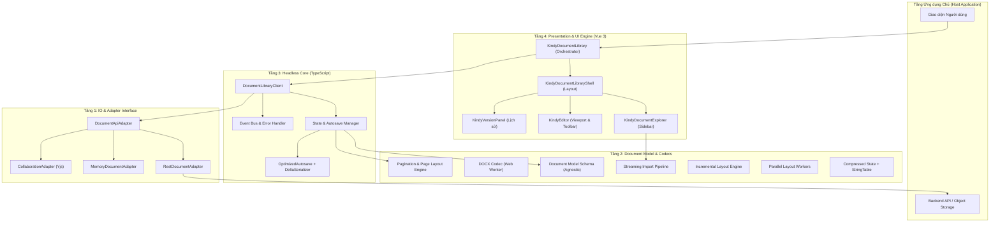

# Tổng quan Kiến trúc Phân tầng

Kindy Editor được thiết kế theo mô hình phân tầng chặt chẽ (Layered Architecture), đảm bảo tách biệt tuyệt đối giữa tầng Dữ liệu, Xử lý Logic, Trình diễn UI và Kết nối Mạng.

---

## Biểu đồ Phân tầng Hệ thống

---

## Chi tiết các Tầng Kiến trúc

### 1. Tầng IO & Adapter Interface
Tầng cơ sở định nghĩa các giao diện trừu tượng để giao tiếp với bên ngoài:
- `DocumentApiAdapter`: Interface chuẩn chứa các thao tác CRUD với tài liệu, quản lý lịch sử phiên bản và lưu trữ artifact.
- `RestDocumentAdapter`: Adapter thực thi gọi HTTP fetch đến REST API theo chuẩn OpenAPI 3.1.
- `MemoryDocumentAdapter`: Adapter lưu trữ trong bộ nhớ RAM của trình duyệt, phục vụ demo, kiểm thử hoặc viết unit test.

### 2. Tầng Document Model & Codecs
- **Model Schema (`src/model/schema.js`)**: Định nghĩa cấu trúc các loại node (paragraph, heading, table, docxTab...) và mark (bold, italic, color...) độc lập với framework.
- **DOCX Codec (`src/codecs/docx.ts`)**: Bộ chuyển đổi hai chiều giữa file OOXML DOCX và `KindyDocumentState` JSON.
- **Streaming Import (`src/codecs/docx-stream.ts`)**: Pipeline import DOCX theo chunks, parse OOXML XML incrementally, yield ProseMirror nodes từng phần. UI không bị treo khi import tài liệu lớn.
- **Layout & Pagination Engine**: Đo chiều cao logic của DOM ProseMirror, tính ngắt trang động và render bề mặt HTML/CSS A4 cố định.
- **Incremental Layout (`src/layout/incremental-layout.js`)**: Theo dõi dirty pages, chỉ re-layout affected pages thay vì toàn bộ document.
- **Parallel Layout (`src/layout/parallel-layout.js`)**: Web Workers song song cho layout computation, chia content thành chunks và merge kết quả.

### 3. Tầng Headless Core (`src/core/`)
- **DocumentLibraryClient (`client.ts`)**: Quản lý vòng đời tài liệu, quản lý trạng thái `KindyDocumentState`, điều phối cơ chế tự động lưu (Autosave có debounce), và kiểm soát xung đột (Optimistic Concurrency).
- **Compressed State (`src/core/compressed-state.ts`)**: Shared StringTable deduplication, nén document state xuống ~40-60% kích thước gốc. LazyCanvasCache chỉ convert visible pages.
- **Delta Autosave (`src/core/delta-autosave.ts`)**: ChangeTracker theo dõi thay đổi, DeltaSerializer serialize chỉ modified nodes, giảm thời gian save từ > 2s xuống < 500ms cho tài liệu lớn.
- Hoàn toàn không phụ thuộc vào Vue/DOM, có thể chạy trong môi trường Node.js.

### 4. Tầng Presentation & UI Engine
- Cung cấp các Vue 3 components cao cấp giúp lập trình viên nhanh chóng tích hợp một Document Library hoàn chỉnh với giao diện đẹp mắt, hỗ trợ Dark Mode và tùy biến theme linh hoạt.

---

## Kiến trúc hiệu năng

Xem [Performance Architecture](./performance-architecture.md) để biết chi tiết 5 trụ cột hiệu năng:

| Trụ cột | Module | Target |
|---|---|---|
| Streaming Import | `src/codecs/docx-stream.ts` | Import 500 trang < 30s |
| Incremental Layout | `src/layout/incremental-layout.js` | Re-layout affected pages < 500ms |
| Compressed State | `src/core/compressed-state.ts` | Giảm ~40-60% RAM |
| Parallel Layout | `src/layout/parallel-layout.js` | Web Workers song song |
| Delta Autosave | `src/core/delta-autosave.ts` | Save < 500ms |
