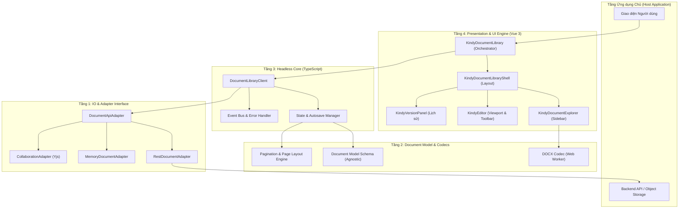

# Tổng quan Kiến trúc Phân tầng

Kindy Editor được thiết kế theo mô hình phân tầng chặt chẽ (Layered Architecture), đảm bảo tách biệt tuyệt đối giữa tầng Dữ liệu, Xử lý Logic, Trình diễn UI và Kết nối Mạng.

---

## Biểu đồ Phân tầng Hệ thống

---

## Chi tiết các Tầng Kiến trúc

### 1. Tầng IO & Adapter Interface
Tầng cơ sở định nghĩa các giao diện trừu tượng để giao tiếp với bên ngoài:
- `DocumentApiAdapter`: Interface chuẩn chứa các thao tác CRUD với tài liệu, quản lý lịch sử phiên bản và lưu trữ artifact.
- `RestDocumentAdapter`: Adapter thực thi gọi HTTP fetch đến REST API theo chuẩn OpenAPI 3.1.
- `MemoryDocumentAdapter`: Adapter lưu trữ trong bộ nhớ RAM của trình duyệt, phục vụ demo, kiểm thử hoặc viết unit test.

### 2. Tầng Document Model & Codecs
- **Model Schema (`src/model/schema.js`)**: Định nghĩa cấu trúc các loại node (paragraph, heading, table, docxTab...) và mark (bold, italic, color...) độc lập với framework.
- **DOCX Codec (`src/codecs/docx.ts`)**: Bộ chuyển đổi hai chiều giữa file OOXML DOCX và `KindyDocumentState` JSON.
- **Layout & Pagination Engine**: Đo đạc chiều cao khối nội dung, tính toán ngắt trang (page break) động, render canvas nhiều trang A4 theo chuẩn in ấn.

### 3. Tầng Headless Core (`src/core/`)
- **DocumentLibraryClient (`client.ts`)**: Quản lý vòng đời tài liệu, quản lý trạng thái `KindyDocumentState`, điều phối cơ chế tự động lưu (Autosave có debounce), và kiểm soát xung đột (Optimistic Concurrency).
- Hoàn toàn không phụ thuộc vào Vue/DOM, có thể chạy trong môi trường Node.js.

### 4. Tầng Presentation & UI Engine
- Cung cấp các Vue 3 components cao cấp giúp lập trình viên nhanh chóng tích hợp một Document Library hoàn chỉnh với giao diện đẹp mắt, hỗ trợ Dark Mode và tùy biến theme linh hoạt.
