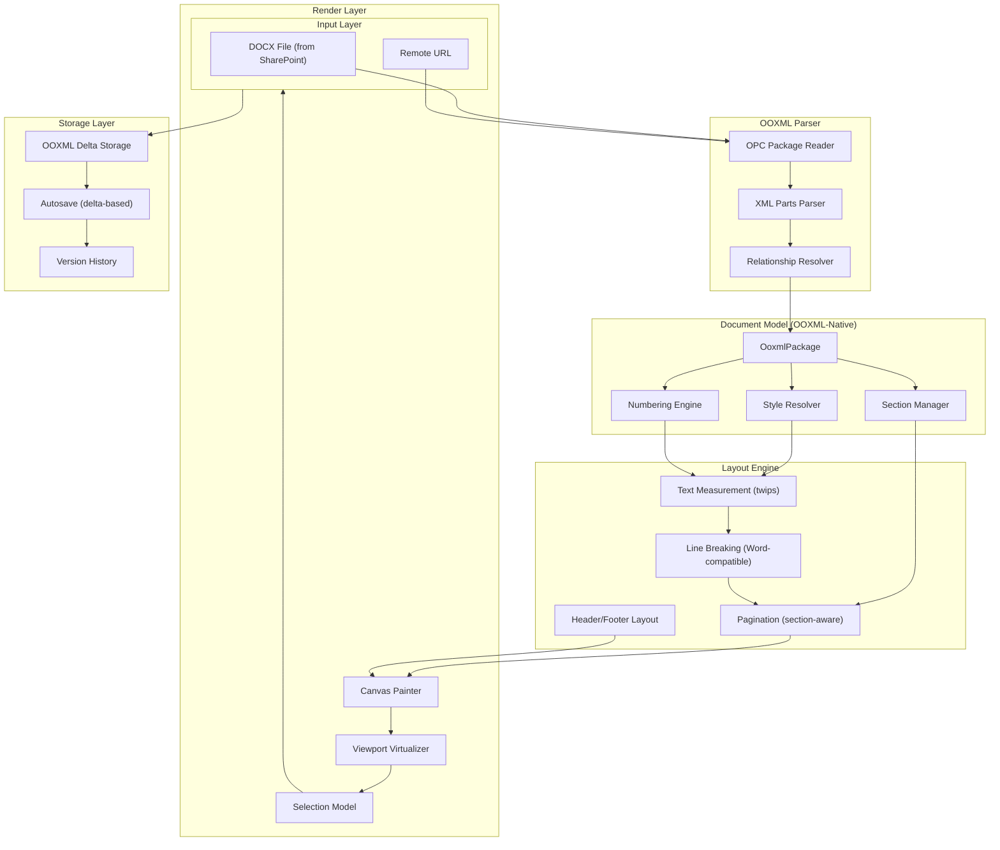

# Tổng quan Kiến trúc — OOXML-Native Architecture

> Version: 3.0
> Date: 2026-08-24
> Status: Active

---

## Vấn đề cốt lõi

Kindy Editor hiện dùng **ProseMirror JSON làm canonical state**, OOXML chỉ là import/export codec. Kết quả:

- **2 lần convert**: OOXML → ProseMirror → Canvas (mất fidelity mỗi bước)
- **Styles bị flatten**: Character styles, table styles → inline formatting
- **Numbering mất**: `lvlText` patterns ("Điều %1.", "(a)", "1.1.") bị discard
- **Floating images**: Tất cả `wp:anchor` → `wp:inline` (mất position, wrapping)
- **Theme fonts**: Không resolve → hiển thị sai font
- **Table styles**: Không parse → mất formatting templates

**Mục tiêu**: OOXML là canonical state trong bộ nhớ. Import = parse trực tiếp, Export = serialize trực tiếp, không qua中间 format.

---

## Kiến trúc hiện tại vs Mục tiêu

```
HIỆN TẠI (ProseMirror-centric):
  DOCX → [Convert] → ProseMirror JSON → [Convert] → Canvas → Display
              ↓                                ↓
         Mất fidelity                    Mất fidelity

MỤC TIÊU (OOXML-native):
  DOCX → [Parse] → OOXML Tree → [Layout] → Layout Tree → [Paint] → Canvas
             ↓                         ↓
        Giữ nguyên fidelity      Tính từ OOXML properties
```

---

## Biểu đồ Kiến trúc mới



---

## OOXML Document Model

### Package Structure

```typescript
interface OoxmlPackage {
  // Core parts
  document: DocumentPart       // word/document.xml
  styles: StylesPart           // word/styles.xml
  numbering: NumberingPart     // word/numbering.xml
  settings: SettingsPart       // word/settings.xml
  fontTable: FontTablePart     // word/fontTable.xml
  theme: ThemePart             // word/theme/theme1.xml

  // Sub-documents
  headers: Map<string, HeaderPart>
  footers: Map<string, FooterPart>
  comments: CommentsPart
  footnotes: FootnotesPart
  endnotes: EndnotesPart

  // Package metadata
  contentTypes: ContentTypes
  relationships: Relationship[]
  core: CoreProperties
  media: Map<string, MediaPart>
}
```

### Paragraph (w:p)

```typescript
interface Paragraph {
  pPr?: ParagraphProperties    // Full OOXML paragraph properties
  content: (Run | Hyperlink | SdtInline)[]

  // Preserved for round-trip
  _raw?: Element               // Original XML element
}

interface ParagraphProperties {
  pStyle?: string              // Style ID reference
  keepNext?: boolean
  keepLines?: boolean
  pageBreakBefore?: boolean
  widowControl?: boolean
  numPr?: NumberingProperties  // { numId, ilvl }
  spacing?: Spacing            // { before, after, line, lineRule }
  ind?: Indentation            // { left, right, firstLine, hanging }
  jc?: Justification           // left, center, right, both
  tabs?: TabStop[]
  shd?: Shading
  pBdr?: ParagraphBorders
  sectPr?: SectionProperties   // Section break embedded in paragraph
  outlineLevel?: number
  rPr?: RunProperties          // Default run properties for paragraph
}
```

### Run (w:r)

```typescript
interface Run {
  rPr?: RunProperties
  content: (Text | Break | Tab | Drawing | Picture)[]
}

interface RunProperties {
  rStyle?: string              // Character style reference
  rFonts?: RunFonts            // { ascii, hAnsi, eastAsia, cs }
  b?: boolean                  // Bold
  i?: boolean                  // Italic
  u?: string                   // Underline style
  strike?: boolean
  sz?: number                  // Font size (half-points)
  color?: string               // Hex color
  highlight?: string           // Highlight color
  shd?: Shading                // Background fill
  vertAlign?: string           // superscript, subscript
  spacing?: number             // Character spacing (hundredths of pt)
  kern?: number                // Kerning (half-points)
  // ... 40+ more properties
}
```

### Table (w:tbl)

```typescript
interface Table {
  tblPr?: TableProperties
  tblGrid: GridColumn[]
  content: TableRow[]
}

interface TableProperties {
  tblStyle?: string            // Table style reference
  tblW?: TableWidth            // { w, type: 'dxa'|'pct'|'auto' }
  tblInd?: number              // Table indent (twips)
  tblBorders?: TableBorders    // { top, bottom, left, right, insideH, insideV }
  jc?: Justification           // Table alignment
  tblLook?: TableLook          // Style inheritance flags
}

interface TableCell {
  tcPr?: TableCellProperties
  content: (Paragraph | Table)[]  // Nested tables supported!
}

interface TableCellProperties {
  gridSpan?: number            // Column span
  vMerge?: 'restart' | 'continue'  // Vertical merge
  tcW?: number                 // Cell width (twips)
  tcMar?: CellMargins          // { top, bottom, left, right }
  shd?: Shading                // Cell background
  vAlign?: string              // top, center, bottom
}
```

### Section Properties (w:sectPr)

```typescript
interface SectionProperties {
  type?: 'nextPage' | 'continuous' | 'evenPage' | 'oddPage'
  pgSz?: PageSize              // { w, h } in twips
  pgMar?: PageMargins          // { top, right, bottom, left, header, footer, gutter }
  cols?: Columns               // { num, space, sep, equalWidth }
  headerReference?: HeaderFooterReference[]
  footerReference?: HeaderFooterReference[]
  titlePg?: boolean            // Different first page
  evenAndOddHeaders?: boolean
  pgNumType?: PageNumberType   // { start, fmt }
  pgBorders?: PageBorders
  lnNumType?: LineNumberType
}
```

---

## Style Resolution Chain (giống Word)

```
w:docDefaults
  └─ w:rPrDefault / w:pPrDefault (base defaults)
      └─ w:style[styleId="Normal"] (normal style)
          └─ w:style[styleId="Heading1"] (basedOn="Normal")
              └─ w:pStyle (paragraph reference from w:pPr)
                  └─ w:rPr (direct formatting on w:r)
                      └─ Character properties (font, size, bold, etc.)
```

**Quy tắc**: Mỗi property được resolve theo thứ tự:
1. `docDefaults` — default cho toàn document
2. `Style basedOn chain` — style inheritance
3. `Paragraph/Character style` — style-specific properties
4. `Direct formatting` — inline overrides

---

## Text Measurement (twips-based)

```
Word units:
  twips = 1/20 pt = 1/1440 inch
  half-points = 1/2 pt (cho font size)
  EMU = 1/914400 inch (cho images)

Conversion:
  1 cm = 566.93 twips
  1 inch = 1440 twips
  1 pt = 20 twips
```

**Text measurement pipeline**:
1. Resolve font (rFonts → theme → fallback)
2. Load font metrics (ascent, descent, avgCharWidth)
3. Measure each character/word width in twips
4. Line breaking at word boundaries (or character boundaries for CJK)
5. Justification distribution

---

## Layout Pipeline

```
OOXML Document
  │
  ├─ Resolve styles (cascade: defaults → style → direct)
  ├─ Resolve numbering (abstractNum → num → lvlText)
  ├─ Resolve sections (pgSz, pgMar, cols, headers/footers)
  │
  ▼
Per-section layout:
  │
  ├─ Measure blocks (paragraph height, table height, image height)
  ├─ Break lines (text width in twips)
  ├─ Distribute to pages (pagination with keep-with-next, widow/orphan)
  ├─ Layout headers/footers (per-variant: default, first, even)
  │
  ▼
Layout Tree:
  │
  ├─ Page 1: { blocks, header, footer, geometry }
  ├─ Page 2: { blocks, header, footer, geometry }
  ├─ ...
  └─ Page N: { blocks, header, footer, geometry }
```

---

## Round-trip Fidelity

### Nguyên tắc

1. **Giữ nguyên gốc**: Mọi element OOXML không hỗ trợ → giữ nguyên `._raw` khi export
2. **Không tự translate**: Không convert element chưa hiểu sang format khác
3. **Validate bằng visual**: Round-trip test = DOCX gốc → Kindy → DOCX xuất lại → so với Word

### Feature preservation matrix

| Feature | Import | Editing | Export | Fidelity |
|---|---|---|---|---|
| Paragraphs + styles | ✅ | ✅ | ✅ | 100% |
| Character styles | 🔨 cần | ✅ | ✅ | 100% (sau fix) |
| Numbering lvlText | 🔨 cần | ✅ | ✅ | 100% (sau fix) |
| Tables (grid, merge) | ✅ | ✅ | ✅ | 95% |
| Table styles | 🔨 cần | ⚠️ | ✅ | 100% (sau fix) |
| Sections | ✅ | ✅ | ✅ | 95% |
| Headers/Footers | ✅ | ✅ | ✅ | 95% |
| Inline images | ✅ | ✅ | ✅ | 100% |
| Floating images | 🔨 cần | ⚠️ | ✅ | 100% (sau fix) |
| Track changes | ✅ | ✅ | ✅ | 90% |
| Comments | ✅ | ✅ | ✅ | 90% |
| Theme fonts | 🔨 cần | ⚠️ | ✅ | 100% (sau fix) |
| Page geometry | ✅ | ✅ | ✅ | 100% |
| Tab stops | ✅ | ✅ | ✅ | 100% |
| Page borders | 🔨 cần | — | ✅ | 100% (sau fix) |
| Columns | 🔨 cần | ⚠️ | ✅ | 100% (sau fix) |
| Footnotes/Endnotes | 🔨 cần | ⚠️ | ✅ | 100% (sau fix) |

**Legend**: ✅ = supported, 🔨 cần = needs implementation, ⚠️ = limited editing, — = not applicable

---

## Priority Order

### P0 — Critical (SharePoint documents break without these)

1. **Character style resolution** — Hyperlink, Strong, Intense Reference styles
2. **Numbering lvlText patterns** — "Điều %1.", "(a)", "1.1.", "I.", "(I)"
3. **Theme fonts** — corporate templates use `majorHAnsi`/`minorEastAsia`

### P1 — High (Significant fidelity loss)

4. **Floating images** — logos, positioned images, watermarks
5. **Table styles** — template formatting
6. **Font fallback chain** — multiple fonts per run

### P2 — Medium (Polish)

7. **Page borders** — decorative elements
8. **Multi-column layouts** — newsletter-style documents
9. **Footnotes/Endnotes** — academic/legal documents

### P3 — Nice-to-have

10. **Complex fields** — TOC, DATE, NUMPAGES
11. **Content controls (SDT)** — form fields
12. **Equations** — Office MathML

---

## File Structure mới

```
src/
├── model/
│   ├── ooxml-types.ts          # OOXML type definitions
│   ├── ooxml-package.ts        # Package structure
│   ├── style-resolver.ts       # Style cascade resolution
│   ├── numbering-engine.ts     # Numbering lvlText resolution
│   └── section-manager.ts      # Section properties
│
├── codecs/
│   ├── ooxml-parser.ts         # DOCX → OoxmlPackage (replaces docx.ts)
│   ├── ooxml-serializer.ts     # OoxmlPackage → DOCX
│   ├── ooxml-streaming.ts      # Streaming parser for large docs
│   └── ooxml-roundtrip.ts      # Round-trip validator
│
├── layout/
│   ├── ooxml-layout.ts         # Main layout engine
│   ├── ooxml-text-measure.ts   # Text measurement (twips)
│   ├── line-breaker.ts         # Word-compatible line breaking
│   ├── ooxml-pagination.ts     # Section-aware pagination
│   └── header-footer-layout.ts # Header/footer layout
│
├── canvas/
│   ├── ooxml-painter.ts        # Paint from OOXML layout
│   ├── ooxml-selection.ts      # Selection model
│   └── ooxml-input.ts          # Input handler
│
├── core/
│   ├── ooxml-transaction.ts    # Edit transactions
│   ├── ooxml-revisions.ts      # Track changes
│   ├── ooxml-comments.ts       # Comments
│   ├── ooxml-ot.ts             # Operational Transform
│   └── ooxml-delta.ts          # Delta storage
│
└── test/
    ├── fixtures/               # DOCX test files from Word
    ├── roundtrip/              # Round-trip test results
    └── visual/                 # Visual comparison screenshots
```

---

## Reference

- [ECMA-376](https://www.ecma-international.org/publications-and-standards/standards/ecma-376/) — OOXML standard
- [ooxml.dev](https://ooxml.dev) — Interactive spec explorer
- [SuperDoc](https://superdoc.dev) — Open-source OOXML-native renderer
- [MS-DOCX](https://learn.microsoft.com/en-us/openspecs/office_standards/ms-docx) — Word extensions
