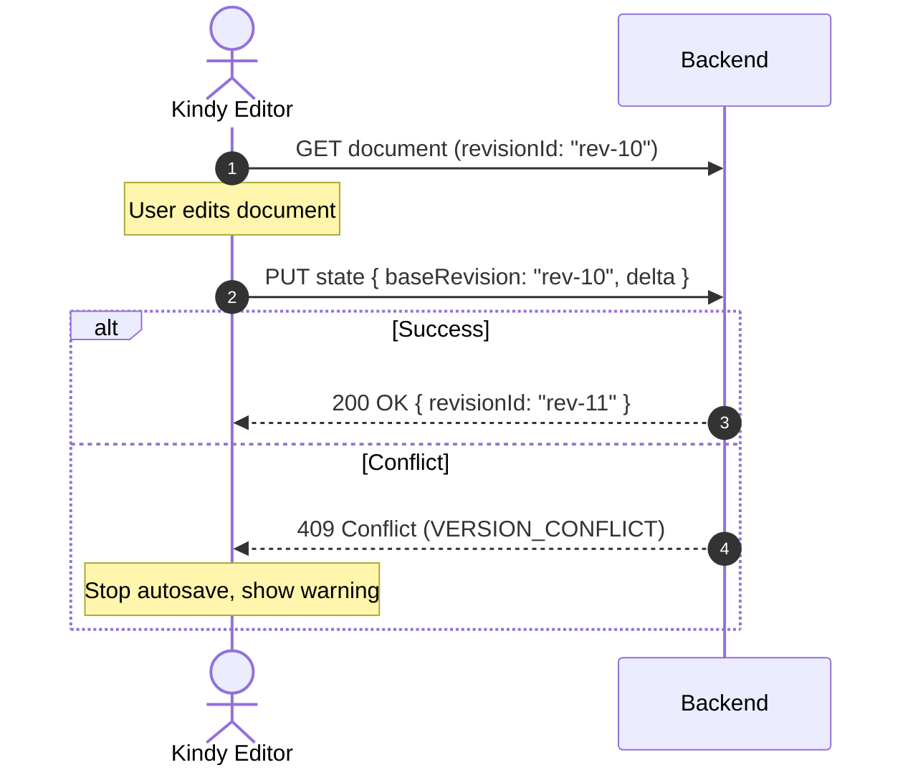

# Lưu trữ & Concurrency — OOXML-Native

> Version: 3.0
> Date: 2026-08-24
> Status: Active

---

## 1. OOXML Canonical State

Kindy Editor dùng `OoxmlPackage` làm canonical state trong bộ nhớ:

```typescript
interface OoxmlPackage {
  document: DocumentPart
  styles: StylesPart
  numbering: NumberingPart
  settings: SettingsPart
  headers: Map<string, HeaderPart>
  footers: Map<string, FooterPart>
  comments: CommentsPart
  // ... other parts
}
```

- **Import**: DOCX → OoxmlPackage (parse trực tiếp, không convert)
- **Editing**: Modify OoxmlPackage trực tiếp
- **Export**: OoxmlPackage → DOCX (serialize trực tiếp, không reconstruct)
- **Storage**: Save OoxmlPackage hoặc delta

---

## 2. Delta Storage

### 2.1 Problem

Serialize toàn bộ OoxmlPackage cho 500 trang rất chậm.

### 2.2 Solution

Chỉ serialize thay đổi (delta):

```typescript
interface OoxmlDelta {
  operations: Operation[]
  timestamp: number
  baseHash: string
}

interface Operation {
  type: 'insert' | 'delete' | 'replace' | 'move'
  path: number[]              // Path in OOXML tree
  content?: OoxmlNode         // New content
  length?: number              // For delete
}
```

### 2.3 Delta Flow

```
User edit
  │
  ▼
Transaction applied to OoxmlPackage
  │
  ├─ DeltaRecorder.record(operation)
  │
  ▼
Debounced save (1000ms)
  │
  ├─ Create delta from recorded operations
  ├─ Serialize delta (small)
  ├─ Send to server
  │
  ▼
Server stores: full state + delta history
```

---

## 3. Optimistic Concurrency

### 3.1 Conflict Detection

```typescript
interface SaveRequest {
  documentId: string
  baseRevisionId: string       // Client's revision when editing started
  delta: OoxmlDelta            // Changes since base revision
  clientMutationId: string     // UUID for deduplication
}
```

### 3.2 Conflict Resolution



---

## 4. Version History

### 4.1 Storage Model

```
Document: { id, title, createdAt, updatedAt }

Revisions:
  rev-1: { full OoxmlPackage, timestamp, author }
  rev-2: { delta from rev-1, timestamp, author }
  rev-3: { delta from rev-2, timestamp, author }
  ...

Snapshots:
  Every N revisions → full snapshot (for fast restore)
```

### 4.2 Version Restore

```typescript
class VersionManager {
  // Restore to specific revision
  async restoreVersion(documentId: string, revisionId: string): Promise<OoxmlPackage> {
    // 1. Find nearest snapshot before revisionId
    // 2. Apply deltas from snapshot to revisionId
    // 3. Return reconstructed OoxmlPackage
  }
}
```

---

## 5. Import/Export

### 5.1 Import Pipeline

```
DOCX file (from SharePoint)
  │
  ▼
fflate.unzipSync(buffer)
  │
  ├─ [Content_Types].xml
  ├─ word/document.xml → DOMParser
  ├─ word/styles.xml → DOMParser
  ├─ word/numbering.xml → DOMParser
  ├─ word/settings.xml → DOMParser
  ├─ word/_rels/document.xml.rels → Map<rId, target>
  ├─ word/header1.xml → DOMParser
  ├─ word/footer1.xml → DOMParser
  ├─ word/comments.xml → DOMParser
  └─ word/media/* → Blob data
  │
  ▼
Build OoxmlPackage (canonical state)
```

### 5.2 Export Pipeline

```
OoxmlPackage
  │
  ├─ Serialize document.xml
  ├─ Serialize styles.xml
  ├─ Serialize numbering.xml
  ├─ Serialize settings.xml
  ├─ Serialize headers/*.xml
  ├─ Serialize footers/*.xml
  ├─ Serialize comments.xml
  ├─ Build [Content_Types].xml
  ├─ Build _rels/*.rels
  ├─ Copy media/*
  │
  ▼
fflate.zipSync(parts)
  │
  ▼
DOCX Blob
```

### 5.3 Round-trip Validation

```typescript
async function validateRoundtrip(original: Blob): Promise<RoundtripReport> {
  // 1. Parse original
  const pkg1 = await parseDocx(original)

  // 2. Serialize
  const exported = await serializeDocx(pkg1)

  // 3. Parse exported
  const pkg2 = await parseDocx(exported)

  // 4. Compare
  return {
    structuralMatch: compareStructure(pkg1, pkg2),
    visualMatch: await compareVisual(original, exported),
    fidelityScore: calculateFidelity(pkg1, pkg2)
  }
}
```
