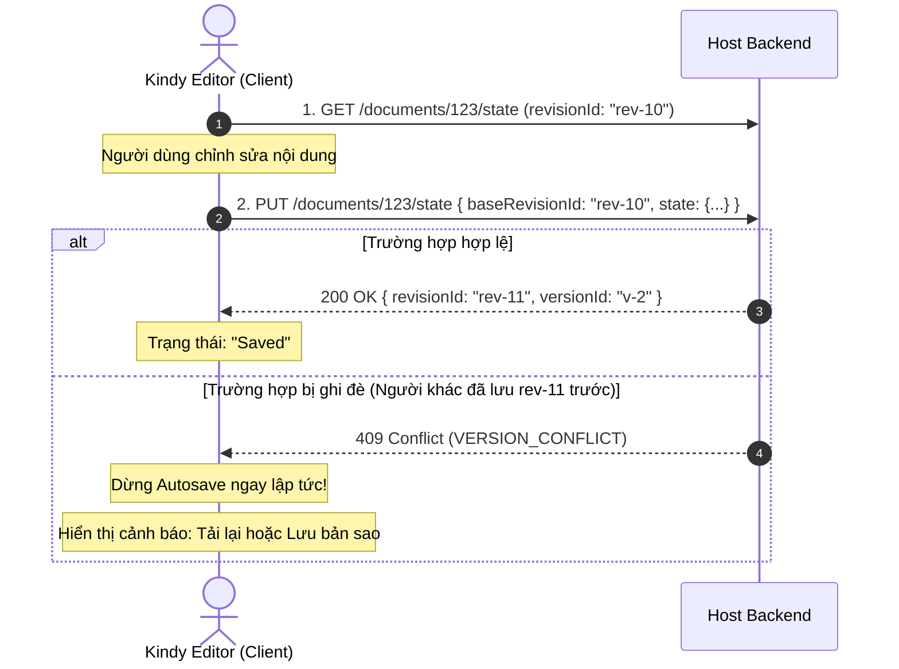

# Mô hình Lưu trữ & Concurrency

Kindy Editor áp dụng mô hình dữ liệu **Canonical JSON State** kết hợp chiến lược lưu trữ **Dual-Artifact** và cơ chế kiểm soát đồng thời lạc quan (**Optimistic Concurrency Control**).

---

## 1. Cấu trúc Trạng thái Chuẩn (`KindyDocumentState`)

Dữ liệu lưu trữ chính của editor được cấu trúc dưới dạng JSON chuẩn:

```typescript
export interface KindyDocumentState {
  schemaVersion: '2.0'
  content: JSONContent       // ProseMirror / Tiptap JSON Tree
  page: KindyPageState       // Cấu hình trang in, khổ giấy, margin, header/footer
  assets: AssetReference[]   // Danh sách tài nguyên đính kèm (ảnh, media)
}
```

> **Tại sao không lưu HTML?**
> HTML không lưu giữ được đầy đủ thông tin trang in, cấu hình Header/Footer khác nhau giữa trang chẵn/lẻ, vị trí tab stop và layout Word. JSON State đảm bảo khả năng serialize 2 chiều chính xác với DOCX.

---

## 2. Chiến lược Dual-Artifact Storage

Để giải quyết bài toán toàn vẹn dữ liệu khi người dùng tải lên tài liệu DOCX gốc có nhiều định dạng phức tạp:

```text
[Người dùng Upload file.docx]
       │
       ├─► Backend lưu Blob gốc (document_artifacts: 'original-docx')
       └─► Parse ra KindyDocumentState (document_revisions: 'rev-import-1')
```

- **Trường hợp 1: Tải về khi CHƯA SỬA ĐỔI**
  - Nếu `currentRevisionId` vẫn bằng `originalSource.revisionId`, hệ thống trả về đúng **file binary DOCX gốc**. Đảm bảo giữ nguyên vẹn 100% byte-for-byte mọi macro, SmartArt, đồ họa nâng cao của Microsoft Word.
- **Trường hợp 2: Tải về khi ĐÃ CÓ CHỈNH SỬA**
  - Khi người dùng đã gõ hoặc chỉnh sửa và lưu thành revision mới, hệ thống kích hoạt **DOCX Serializer** để dựng file OOXML DOCX mới từ `KindyDocumentState`.

---

## 3. Quản lý Phiên bản & Cơ chế Concurrency (409 Conflict)

Khi nhiều người dùng cùng truy cập hoặc khi autosave chạy liên tục, Kindy Editor sử dụng kỹ thuật **Optimistic Locking**:



### Quy trình xử lý xung đột:
1. Mỗi lần lưu, client gửi kèm `baseRevisionId` và `clientMutationId` (UUID duy nhất tránh gửi lặp khi mạng chập chờn).
2. Phía Server kiểm tra nếu `current_revision_id !== baseRevisionId`, Server trả về mã lỗi **HTTP 409 Conflict** với mã lỗi `VERSION_CONFLICT`.
3. Client tự động ngắt timer Autosave để tránh làm mất dữ liệu của người dùng, đồng thời phát sinh sự kiện `save-failed` để giao diện hiển thị hộp thoại xử lý cho người dùng.
