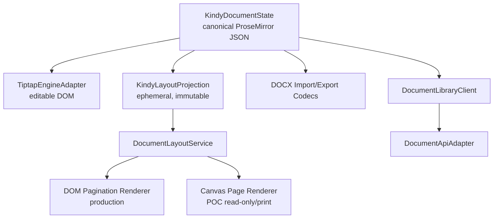

# Đánh giá kiến trúc `canvas-editor` cho Kindy Editor

> Trạng thái: Accepted — quyết định kiến trúc chính thức  
> Ngày đánh giá: 24/08/2026  
> Nguồn được đọc: `/Users/kindy/datas/App/canvas-editor` tại commit
> `03a481bbd012f2dcb4044cd34471477db921fe52`  
> Phạm vi: đánh giá tĩnh source code. Chưa benchmark runtime và chưa kiểm thử
> DOCX plugin bên ngoài của `canvas-editor`.

## 1. Kết luận ngắn

`canvas-editor` **không phù hợp để thay trực tiếp Tiptap/ProseMirror trong Kindy
Editor v2** và cũng không nên được nhúng song song như một editable surface thứ
hai ở thời điểm hiện tại.

Lý do chính:

1. `canvas-editor` có document model, layout, selection, cursor, history và
   command system riêng. Nó không chỉ là renderer.
2. Canonical state của Kindy là ProseMirror JSON. Đưa `canvas-editor` vào làm
   editor chính sẽ tạo hai nguồn sự thật và cần một bộ chuyển đổi hai chiều lớn,
   dễ mất dữ liệu DOCX, comment, Track Changes và transaction mapping.
3. Core `canvas-editor` không chứa DOCX codec. Import/export DOCX được mô tả qua
   một plugin ở repository/package khác, không có trong source đã đánh giá.
4. Lazy rendering hiện tại chỉ trì hoãn thao tác vẽ; engine vẫn layout toàn bộ
   document, tạo position list toàn bộ và tạo một backing canvas cho mỗi trang.
   Đây là rủi ro lớn với tài liệu 100–200 trang.
5. Canvas cho kiểm soát hình học tốt hơn DOM, nhưng không tự động mang lại độ
   tương thích 100% với Microsoft Word. Font metrics, OOXML mapping, section,
   field, drawing anchor và rule phân trang vẫn phải được triển khai và kiểm thử.

Tuy nhiên, `canvas-editor` **phù hợp để tham khảo và tái sử dụng có chọn lọc ở
lớp layout/render**. Các phần đáng học nhất là:

- mô hình `row -> page -> position`;
- tách data table khỏi table fragments khi phân trang;
- page geometry và canvas riêng theo trang;
- image layout modes và image cache;
- header/footer layout cache;
- hit-testing bằng position list;
- viewport observer và lazy paint;
- command/event façade tách UI khỏi engine.

Quyết định đề xuất:

> Giữ `KindyDocumentState` và Tiptap/ProseMirror làm canonical editing engine.
> Tạo một `DocumentLayoutService` độc lập, học các thuật toán layout tốt từ
> `canvas-editor`. Nếu cần, làm POC canvas ở chế độ read-only/print trước; không
> cho canvas ghi ngược canonical state trong phase đầu.

Quyết định này đã được chủ dự án chấp thuận ngày 24/08/2026. Không fork
`canvas-editor` để thay Tiptap và không xây editable canvas surface song song.

## 2. Kiến trúc thực tế của `canvas-editor`

### 2.1. Luồng khởi tạo

Entry point nhận `IEditorData` hoặc `IElement[]`, clone và normalize dữ liệu,
sau đó khởi tạo một `Draw` cùng command, menu, shortcut, register và plugin
façade.

```text
IEditorData
  -> formatElementList
  -> Draw
       -> layout rows/pages/positions
       -> canvas page list
       -> cursor/range/input/history
       -> particles: text/image/table/...
  -> CommandAdapt -> Command
  -> Listener + EventBus
  -> Plugin.use(editor)
```

Nguồn:

- `canvas-editor/src/editor/index.ts:80-169`
- `canvas-editor/src/editor/core/draw/Draw.ts:137-344`
- `canvas-editor/src/editor/core/command/Command.ts:1-180`

Điều này xác nhận `Draw` đang đóng vai trò application kernel, không phải một
canvas renderer độc lập có thể cắm thẳng vào Kindy.

### 2.2. Document model

Public data gồm ba vùng:

```ts
interface IEditorData {
  header?: IElement[]
  main: IElement[]
  footer?: IElement[]
  graffiti?: IGraffitiData[]
}
```

`IElement` là một kiểu hợp lớn chứa text style, table, hyperlink, control,
image, list, title, trace, area và page-break attributes. Runtime normalize text
thành các element nhỏ theo ký tự/grapheme; khi `getValue`, engine lại zip các
element liên tiếp thành cấu trúc gọn hơn.

Nguồn:

- `canvas-editor/src/editor/interface/Editor.ts:43-48`
- `canvas-editor/src/editor/interface/Element.ts:22-236`
- `canvas-editor/src/editor/utils/element.ts:103-142`
- `canvas-editor/src/editor/utils/element.ts:753-1062`

Ưu điểm:

- Áp style và hit-testing ở mức ký tự trực tiếp.
- Dễ tính chính xác vị trí từng glyph/element sau khi layout.
- Có thể giữ table là một object ở data layer trong khi chia thành fragment ở
  render layer.

Giới hạn so với Kindy:

- Paragraph không phải một node semantic rõ như ProseMirror paragraph; nhiều
  đặc tính cấu trúc được trải trên element và ký tự xuống dòng.
- Heading/list/hyperlink có bước flatten rồi zip lại. Việc round-trip qua nhiều
  lần chuyển đổi làm tăng rủi ro mất identity hoặc thuộc tính OOXML không thuộc
  model.
- Một `IElement` chứa quá nhiều concern. Schema mở rộng nhưng khó đặt invariant
  và migration độc lập theo từng node type.
- Model này không tương thích trực tiếp với `KindyDocumentState.content`.

### 2.3. Layout và pagination

Pipeline chính trong mỗi lần `render`:

```text
elementList
  -> computeRowList()
  -> TablePaging.splitTableRowAcrossPages()
  -> _computePageList()
  -> Position.computePositionList()
  -> _drawPage()
```

Nguồn:

- `canvas-editor/src/editor/core/draw/Draw.ts:1632-2329`
- `canvas-editor/src/editor/core/draw/Draw.ts:2332-2425`
- `canvas-editor/src/editor/core/draw/Draw.ts:3102-3267`
- `canvas-editor/src/editor/core/position/Position.ts`

Điểm tốt:

- Page có width/height cố định; trang cuối không tự fit theo content ở paging
  mode.
- Mỗi position biết `pageNo`, `rowNo`, metrics và bốn góc tọa độ.
- Manual page break là element semantic.
- Table paging giữ một table duy nhất ở data layer và tạo `ITableRowFragment`
  cho render. Thuật toán còn xử lý repeated table header, rowspan và split row.
- Orientation có thể đổi sau page break.

Nguồn table paging:

- `canvas-editor/src/editor/interface/Element.ts:245-280`
- `canvas-editor/src/editor/core/draw/particle/table/TablePaging.ts:12-320`

Giới hạn:

- Mỗi input bình thường gọi `draw.render()`. Với `isCompute=true` mặc định,
  engine tính lại rows, pages và positions trên toàn document.
- Worker hiện chỉ chạy word count, catalog, group và value serialization; layout
  chính vẫn ở main thread.
- Section model chưa đủ cho DOCX contract profile. Page break chỉ giữ orientation
  của phần sau; width, height, margins, page-number restart, different-first-page
  và odd/even header/footer không nằm trong section object đầy đủ.
- Header/footer là một cặp element list dùng chung; có thể disable theo page,
  nhưng chưa tương đương relationship-based header/footer của OOXML.

### 2.4. Render pipeline

Mỗi trang là một `<canvas>`. `_drawPage` vẽ theo layer:

1. background/area/column separator;
2. watermark dưới content;
3. margin và float image dưới text;
4. content rows;
5. header/page number/footer;
6. float image trên text, search, border, badge, graffiti và watermark trên.

Nguồn:

- `canvas-editor/src/editor/core/draw/Draw.ts:2949-3061`
- `canvas-editor/src/editor/core/draw/particle/ImageParticle.ts:224-280`

Đây là hướng tốt cho preview có hình học ổn định. Zoom cũng thay logical scale và
re-layout toàn bộ thay vì chỉ phóng to text rời rạc, nên không gặp kiểu lỗi
container scale nhưng nội dung giữ width cũ.

Tuy nhiên, tính “pixel controlled” không đồng nghĩa “giống Word 100%”. Engine vẫn
dùng browser canvas font metrics và font cài trên máy. Word có layout rules, font
substitution, line-breaking, compatibility flags và OOXML semantics riêng.

### 2.5. Input, selection và accessibility

Canvas không có native caret/contenteditable. Engine dùng một `<textarea>` ẩn để
nhận keyboard, paste và IME composition; caret hiển thị là một DOM element riêng.
Selection và hit-testing dựa trên `positionList`.

Nguồn:

- `canvas-editor/src/editor/core/cursor/CursorAgent.ts:8-74`
- `canvas-editor/src/editor/core/cursor/Cursor.ts:27-192`
- `canvas-editor/src/editor/core/event/handlers/input.ts:13-143`
- `canvas-editor/src/editor/core/event/handlers/composition.ts`

Đây là kiến trúc hợp lệ cho canvas editor, nhưng Kindy sẽ phải tự chịu trách nhiệm
cho toàn bộ edge case mà browser/ProseMirror đang xử lý: Vietnamese IME, mobile
keyboard, selection granularity, clipboard, drag/drop và bidirectional text.

Accessibility hiện bổ sung `aria-live` để đọc input/selection, nhưng nội dung
canvas không trở thành document tree semantic cho screen reader.

Nguồn: `canvas-editor/src/editor/core/accessibility/Accessibility.ts:7-78`.

### 2.6. History, review và realtime

History giữ closure chứa snapshot clone của header/main/footer, range và context.
Mỗi record có thể giữ một document snapshot đáng kể.

Nguồn:

- `canvas-editor/src/editor/core/history/HistoryManager.ts:3-60`
- `canvas-editor/src/editor/core/draw/Draw.ts:3316-3343`

Track/trace lưu record insert/delete trên element. Group IDs có thể làm anchor
cho comment UI. Tuy nhiên source chính chưa có API accept/reject change đầy đủ và
comment thread model đầy đủ như yêu cầu Kindy. Realtime/CRDT chỉ được README ghi
là experimental branch; package hiện tại không có Yjs/CRDT implementation.

### 2.7. IO và DOCX

Core cung cấp:

- JSON `getValue`/`setValue`;
- HTML/text conversion;
- page image export;
- print bằng page images trong iframe.

Nguồn: `canvas-editor/src/editor/core/command/CommandAdapt.ts:1404-1545`.

DOCX không nằm trong core và không có dependency DOCX/OOXML trong package hiện
tại. Tài liệu chỉ hướng dẫn dùng package ngoài:
`@hufe921/canvas-editor-plugin-docx`.

Nguồn: `canvas-editor/docs/guide/plugin-internal.md:55-71`.

Vì source plugin không có trong checkout, đánh giá này **không xác nhận**:

- phạm vi OOXML mà plugin import/export được;
- round-trip header/footer, section, numbering, comments, tracked changes;
- khả năng giữ unknown OOXML;
- license, bundle size và mức bảo trì của plugin.

Do đó không thể dùng tuyên bố “có DOCX plugin” làm bằng chứng cho fidelity DOCX
của Kindy.

## 3. Đối chiếu với kiến trúc Kindy hiện tại

### 3.1. Kindy đang có gì

Canonical state:

```ts
interface KindyDocumentState {
  schemaVersion: '2.0'
  content: JSONContent
  page: KindyPageState
  assets: AssetReference[]
}
```

Nguồn: `src/core/types.ts:3-65`.

Các boundary đã có:

- `DocumentApiAdapter` cho storage/version/artifact;
- `EditorEngineAdapter` cho engine;
- `TiptapEngineAdapter` là implementation hiện tại;
- DOCX codec và worker riêng;
- page/section state riêng với stable section ID;
- collaboration contract riêng.

Nguồn:

- `src/core/types.ts:211-253`
- `src/engines/tiptap.ts:17-63`
- `src/codecs/docx.ts`
- `src/codecs/docx.worker.ts`

Editing surface hiện là một ProseMirror DOM liên tục. Pagination đo top-level DOM
blocks, cache measurement và chèn page gap bằng decorations. Zoom là CSS transform
trên surface logic, không thay canonical geometry.

Nguồn:

- `src/extensions/pagination.js:1-22`
- `src/extensions/pagination.js:406-633`
- `src/utils/dom-page-calculator.js:69-304`
- `src/components/container/page.vue`

### 3.2. Bảng so sánh

| Tiêu chí | Kindy/Tiptap hiện tại | `canvas-editor` hiện tại | Đánh giá |
|---|---|---|---|
| Canonical document | ProseMirror tree semantic | `IElement[]`, runtime gần mức ký tự | Không tương thích trực tiếp |
| Native editing/IME | Browser + ProseMirror | Textarea proxy + custom caret | Kindy an toàn hơn cho input/a11y |
| Page geometry | DOM measurement + decoration | Layout và canvas theo trang | Canvas mạnh hơn |
| Split paragraph/table | Block-level còn hạn chế | Row-level, có table fragments | Canvas mạnh hơn |
| Zoom | CSS transform, không reflow | Full scale + re-layout | Cả hai hợp lệ; canvas tốn compute hơn |
| DOCX import/export | Codec nằm trong repository | External plugin không có source | Kindy kiểm soát tốt hơn |
| Section/header/footer | Canonical section state đang mở rộng | Chủ yếu global; break đổi orientation | Kindy model phù hợp OOXML hơn |
| Comments/review | Tích hợp vào ProseMirror schema/roadmap | Group/trace primitives | Không đủ để thay Kindy |
| Realtime | Yjs/ProseMirror boundary có sẵn | Experimental branch ngoài main | Không phù hợp v2.1 |
| 100 trang | DOM toàn document; đã có benchmark | Full layout + canvas/page | Cả hai cần guardrail; canvas hiện có memory risk |
| Extensibility | Tiptap extension + engine adapter | command/register/plugin callback | Cả hai mở rộng được, canvas core tightly coupled hơn |
| Phạm vi sản phẩm | DOCX contract editor/library | General/EMR/form/cascade/graffiti | Canvas mang nhiều module ngoài scope |

## 4. Rủi ro hiệu năng 100–200 trang của `canvas-editor`

### 4.1. Lazy paint không phải virtualization đầy đủ

`IntersectionObserver` chỉ gọi `_drawPage` khi page đi vào viewport. Trước đó,
`render()` vẫn:

- tính toàn bộ row list;
- split table fragments;
- tính page list;
- tính toàn bộ position list;
- tạo canvas cho mọi page.

Nguồn:

- `canvas-editor/src/editor/core/draw/Draw.ts:3067-3087`
- `canvas-editor/src/editor/core/draw/Draw.ts:3102-3209`

### 4.2. Backing-store memory

Default page là 794 × 1123 logical pixels. `_createPage` đặt backing store theo
`width * devicePixelRatio` và `height * devicePixelRatio`.

Nguồn:

- `canvas-editor/src/editor/utils/option.ts:216-255`
- `canvas-editor/src/editor/core/draw/Draw.ts:1534-1557`

Ước lượng bitmap RGBA chưa tính object/cache khác:

```text
DPR 1: 794 × 1123 × 4 bytes ≈ 3,40 MiB/trang
100 trang ≈ 340 MiB

DPR 2: 1588 × 2246 × 4 bytes ≈ 13,61 MiB/trang
100 trang ≈ 1,33 GiB
```

Đây là kích thước lý thuyết; browser/GPU có thể quản lý allocation khác nhau,
nhưng bắt buộc phải đo browser process và GPU memory, không chỉ JS heap.

Muốn dùng canvas cho 100–200 trang, kiến trúc cần đổi thành:

- DOM placeholder cho toàn bộ page;
- pool khoảng 3–7 canvas tái sử dụng quanh viewport;
- cache page bitmap có giới hạn hoặc bỏ cache;
- incremental layout từ vùng document bị đổi;
- không clone toàn document cho mỗi history record.

Những điểm này chưa có trong source hiện tại và sẽ tạo một fork đáng kể.

## 5. Những phần nên học hoặc tái sử dụng

### Mức ưu tiên cao

1. **Layout projection**: `IRow`, `IElementMetrics`, `IElementPosition` và page
   assignment nên được dùng làm tài liệu tham khảo cho `KindyLayoutTree`.
2. **Table fragments**: port ý tưởng “data table duy nhất, render fragments theo
   trang” thay vì chia canonical table thành nhiều node.
3. **Page renderer layers**: chuẩn hóa thứ tự background, watermark, floating
   object, content, header/footer và overlay.
4. **Image modes**: inline/block/surround/float-top/float-bottom và cache ảnh.
5. **Page viewport observer**: dùng cho current page, preload và renderer pool.

### Mức ưu tiên trung bình

1. Command façade và typed event bus.
2. Header/footer layout cache theo orientation.
3. Position/hit-test index cho read-only preview.
4. Print bằng page image như một optional renderer, không thay DOCX/PDF codec.

### Không nên đưa nguyên khối vào Kindy

1. `IElement[]` làm canonical state.
2. `Draw` làm god object chứa toàn bộ subsystem.
3. Snapshot closure history.
4. Hidden textarea/canvas selection cho production editor ngay lập tức.
5. Form controls, cascade, calculator, graffiti, macro và EMR-specific modules
   không thuộc phạm vi Document Library DOCX.
6. External DOCX plugin khi chưa audit source và golden corpus.

## 6. Kiến trúc mục tiêu đề xuất



### 6.1. Boundary mới

```ts
interface DocumentLayoutService {
  layout(input: {
    state: KindyDocumentState
    viewport: LayoutViewport
    invalidation?: LayoutInvalidation
    signal?: AbortSignal
  }): Promise<KindyLayoutTree>
}

interface PageRenderAdapter {
  readonly mode: 'editable-dom' | 'readonly-canvas' | 'print-canvas'
  renderPage(page: KindyLayoutPage, target: HTMLElement): void | Promise<void>
  releasePage(pageId: string): void
  destroy(): void
}
```

Nguyên tắc bắt buộc:

- `KindyDocumentState` là source of truth duy nhất.
- `KindyLayoutProjection` và canvas positions là dữ liệu dẫn xuất, không save qua
  `DocumentApiAdapter`.
- Canvas phase đầu không được edit hoặc ghi ngược full blob vào ProseMirror.
- DOCX codec đọc/ghi canonical state, không đọc canvas pixels.
- Page renderer có thể thay mà adapter API/storage/version không đổi.

### 6.2. Vì sao không dùng hybrid editable canvas overlay

Không đặt một canvas text layer lên trên/bên dưới ProseMirror editable text để cả
hai cùng hiển thị. Hai engine sẽ khác line break, selection, scroll offset và font
metrics. Kết quả là caret không khớp text, click/hit-test sai và rất khó map comment
hoặc tracked-change range.

Nếu làm canvas editor đầy đủ trong tương lai, nó phải là một implementation hoàn
chỉnh của `EditorEngineAdapter`, được chọn thay cho Tiptap tại mount time, không
chạy đồng thời trên cùng document view.

## 7. Khả năng làm `CanvasEditorEngineAdapter`

Về mặt interface, có thể tạo adapter:

```ts
class CanvasEditorEngineAdapter implements EditorEngineAdapter {
  readonly id = 'canvas-editor'
  mount(container, options): EditorEngineHandle
}
```

Nhưng adapter này cần ít nhất:

1. `KindyDocumentState -> IEditorData` converter;
2. `IEditorData -> ProseMirror JSON` converter;
3. mapping asset IDs/data URLs;
4. mapping paragraphs, marks, nested list, table, page/section, header/footer;
5. mapping comment và Track Changes identities/ranges;
6. mapping every canvas mutation thành transaction có identity ổn định;
7. history và collaboration integration;
8. compatibility report cho phần không ánh xạ được.

Nếu converter chỉ replace toàn document sau mỗi thay đổi, autosave còn chạy được
nhưng undo mapping, concurrent editing, comments và realtime sẽ không đạt yêu cầu.
Vì vậy adapter editable chỉ nên được mở lại sau khi POC read-only chứng minh được
giá trị đủ lớn.

## 8. Lộ trình POC khuyến nghị

### Phase 0 — Audit và corpus, 2–3 ngày

- Lấy 10 DOCX hợp đồng đại diện: text, list đa cấp, bảng, ảnh, header/footer,
  section, trang ký, comment và tracked changes.
- Chốt mapping matrix giữa ProseMirror schema, OOXML và `IElement`.
- Audit riêng source của DOCX plugin nếu muốn dùng.

Kết quả: mapping matrix và danh sách loss rõ ràng. Không viết adapter production.

### Phase 1 — Canvas read-only page renderer, 1–2 tuần

- Tạo one-way `KindyDocumentState -> KindyLayoutProjection`.
- Render 3 trang quanh viewport bằng canvas pool; các trang khác là placeholder.
- Không dùng history, input, selection hay command của `canvas-editor`.
- So page count, table split, image placement và print preview với Kindy DOM.

Kết quả: xác nhận canvas có cải thiện layout thực tế hay không.

### Phase 2 — Layout service và incremental pagination, 2–4 tuần

- Tách measurement, row layout, page assignment và table fragments.
- Worker hóa phần không cần DOM.
- Invalidate từ block/section bị đổi, không full layout mọi keystroke.
- Giữ DOM editor production; canvas renderer vẫn optional.

### Phase 3 — Quyết định editor engine

Chỉ xem xét `CanvasEditorEngineAdapter` editable nếu:

- canvas preview vượt DOM rõ rệt trên corpus;
- memory/latency đạt gate 100 trang;
- Vietnamese IME, clipboard, keyboard và accessibility đạt gate;
- DOCX round-trip không giảm capability;
- team chấp nhận chi phí duy trì một input/selection engine riêng.

## 9. Tiêu chí nghiệm thu POC

### Correctness

- Không sửa canonical JSON khi chỉ preview.
- Page size A1–A5, Letter và Legal giữ đúng tỷ lệ ở mọi zoom.
- Mọi trang cùng section có chiều cao cố định, kể cả trang cuối.
- Manual page break và section break giữ vị trí.
- Table fragment không làm thay đổi canonical table.
- Header/footer, ảnh inline/float và trang ký không mất.
- Canvas và DOCX export dùng cùng asset/source data, không raster hóa DOCX text.

### Performance

- 100 trang mixed không tạo 100 backing canvas cùng lúc.
- Số canvas active không vượt `visible pages + 4`.
- Không có full document layout đồng bộ trên mỗi keystroke.
- Typing p95 của editable DOM không xấu hơn baseline hiện tại quá 10%.
- Đo JS heap, DOM nodes, browser process memory và GPU memory.
- Scroll không blank page lâu hơn một frame budget có chủ đích.

### Editing gate nếu làm canvas editable

- Vietnamese Telex/VNI composition trên Chrome, Edge, Safari.
- Enter, Shift+Enter, Ctrl/Cmd+Enter, undo/redo, selection và paste.
- Text, list, nested list, table cell, image và page-break editing.
- Screen reader có document semantics hoặc có accessibility tree tương đương.
- Comment/Track Changes accept/reject và range mapping.
- Concurrent edits không replace/lost-update toàn document.

### DOCX gate

- Golden DOCX corpus import/export qua Microsoft Word và LibreOffice không repair.
- So sánh text, styles, numbering, table grid, merge cells, media relationships,
  sections, headers/footers và page breaks.
- Unsupported OOXML luôn có compatibility warning; không drop âm thầm.

## 10. Quyết định cuối cùng

| Phương án | Quyết định | Lý do |
|---|---|---|
| Thay Tiptap bằng `canvas-editor` ngay | Không chọn | Hai model không tương thích, IO/review/realtime chưa đạt |
| Nhúng cả hai editable cùng lúc | Không chọn | Hai layout/caret/selection source of truth |
| Viết canvas engine adapter production ngay | Chưa chọn | Converter và transaction mapping quá lớn |
| Học/port layout primitives | Chọn | Giải quyết đúng điểm yếu pagination/table/image |
| POC canvas read-only/print với canvas pool | Chọn có điều kiện | Đo được lợi ích trước khi tăng độ phức tạp |
| Giữ Tiptap + canonical ProseMirror JSON | Chọn | Phù hợp hợp đồng SDK v2 và DOCX codec hiện tại |

Kết luận thực dụng:

> `canvas-editor` là một nguồn tham khảo tốt cho page layout engine, nhưng chưa
> phải một engine thay thế an toàn cho Kindy. Giá trị cao nhất là port những thuật
> toán layout đã chứng minh được bằng fixture, đặt sau một boundary mới và giữ
> canonical state của Kindy không đổi.
