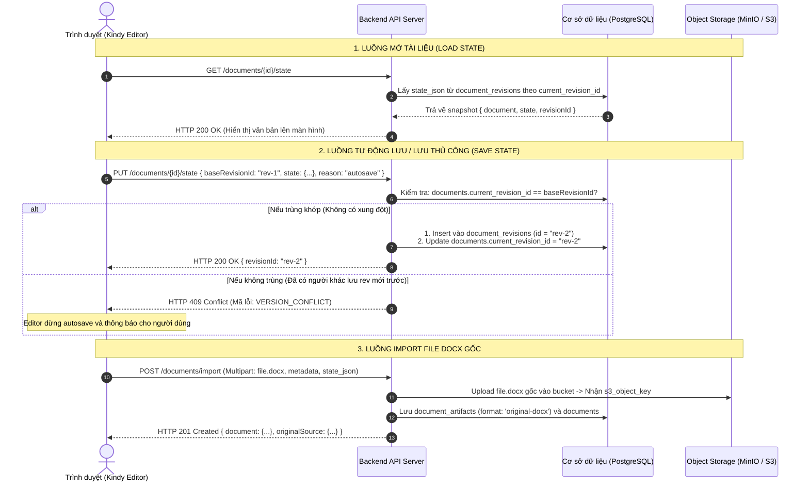

# Thiết kế Database & Lưu trữ cho Backend

Tài liệu này hướng dẫn chi tiết cho các kỹ sư Backend cách thiết kế cơ sở dữ liệu (Database Schema), cấu hình lưu trữ file (Object Storage) và lập trình các API để kết nối hoàn chỉnh với `kindy-editor`.

---

## 1. Nguyên tắc cốt lõi về Dữ liệu

> [!IMPORTANT]
> **Kindy Editor không có cơ sở dữ liệu hay máy chủ riêng.**
> Toàn bộ dữ liệu (tệp `.docx` gốc, cây cấu trúc nội dung JSON, lịch sử các phiên bản, phân quyền người dùng) được lưu trữ **100% trên hạ tầng Database và Object Storage của hệ thống bạn**.

---

## 2. SQL Schema Mẫu (PostgreSQL / MySQL)

Dưới đây là kịch bản khởi tạo bảng (DDL Script) chuẩn để lưu trữ tài liệu, lịch sử chỉnh sửa và artifacts:

```sql
-- 1. Bảng quản lý thư mục (Folders)
CREATE TABLE folders (
    id VARCHAR(64) PRIMARY KEY,
    name VARCHAR(255) NOT NULL,
    parent_id VARCHAR(64) REFERENCES folders(id) ON DELETE CASCADE,
    created_at TIMESTAMP WITH TIME ZONE DEFAULT CURRENT_TIMESTAMP,
    updated_at TIMESTAMP WITH TIME ZONE DEFAULT CURRENT_TIMESTAMP
);

-- 2. Bảng thông tin tài liệu chính (Documents)
CREATE TABLE documents (
    id VARCHAR(64) PRIMARY KEY,
    title VARCHAR(255) NOT NULL,
    file_name VARCHAR(255) NOT NULL,
    folder_id VARCHAR(64) REFERENCES folders(id) ON DELETE SET NULL,
    tags JSONB DEFAULT '[]'::jsonb,
    is_template BOOLEAN DEFAULT FALSE,
    current_revision_id VARCHAR(64),
    current_version_id VARCHAR(64),
    original_artifact_id VARCHAR(64), -- ID file DOCX gốc lúc upload
    metadata JSONB DEFAULT '{}'::jsonb,
    tenant_id VARCHAR(64),            -- Dành cho hệ thống đa doanh nghiệp (Multi-tenant)
    created_by VARCHAR(64),
    created_at TIMESTAMP WITH TIME ZONE DEFAULT CURRENT_TIMESTAMP,
    updated_at TIMESTAMP WITH TIME ZONE DEFAULT CURRENT_TIMESTAMP
);

-- 3. Bảng lưu trữ nội dung từng lần chỉnh sửa (Document Revisions)
CREATE TABLE document_revisions (
    id VARCHAR(64) PRIMARY KEY,       -- rev-xxx
    document_id VARCHAR(64) NOT NULL REFERENCES documents(id) ON DELETE CASCADE,
    base_revision_id VARCHAR(64),     -- Dùng để kiểm tra xung đột ghi đè đồng thời (409 Conflict)
    state_json JSONB NOT NULL,        -- Dữ liệu KindyDocumentState (content, page, assets)
    reason VARCHAR(32) NOT NULL,      -- 'autosave' | 'manual' | 'import' | 'create' | 'restore'
    client_mutation_id VARCHAR(64),   -- UUID tránh lưu lặp khi mạng chập chờn (Idempotency)
    created_by VARCHAR(64),
    created_at TIMESTAMP WITH TIME ZONE DEFAULT CURRENT_TIMESTAMP
);

-- 4. Bảng đánh dấu mốc phiên bản (Document Versions)
CREATE TABLE document_versions (
    id VARCHAR(64) PRIMARY KEY,       -- v-xxx
    document_id VARCHAR(64) NOT NULL REFERENCES documents(id) ON DELETE CASCADE,
    revision_id VARCHAR(64) NOT NULL REFERENCES document_revisions(id) ON DELETE CASCADE,
    version_number INT NOT NULL,      -- 1, 2, 3...
    label VARCHAR(255),               -- 'Bản gửi khách hàng', 'Bản chốt'
    created_by VARCHAR(64),
    created_at TIMESTAMP WITH TIME ZONE DEFAULT CURRENT_TIMESTAMP
);

-- 5. Bảng quản lý tệp tin nhị phân (Document Artifacts - S3 / MinIO)
CREATE TABLE document_artifacts (
    id VARCHAR(64) PRIMARY KEY,
    document_id VARCHAR(64) NOT NULL REFERENCES documents(id) ON DELETE CASCADE,
    version_id VARCHAR(64),
    format VARCHAR(32) NOT NULL,      -- 'original-docx' | 'docx' | 'pdf'
    object_key VARCHAR(512) NOT NULL, -- Đường dẫn lưu trên S3/MinIO bucket
    file_name VARCHAR(255) NOT NULL,
    mime_type VARCHAR(128) NOT NULL,
    size_bytes BIGINT NOT NULL,
    checksum VARCHAR(128),
    created_at TIMESTAMP WITH TIME ZONE DEFAULT CURRENT_TIMESTAMP
);

-- Tạo Index để tăng tốc độ truy vấn
CREATE INDEX idx_documents_folder ON documents(folder_id);
CREATE INDEX idx_revisions_doc ON document_revisions(document_id, created_at DESC);
CREATE INDEX idx_versions_doc ON document_versions(document_id, version_number DESC);
```

---

## 3. Quy trình Xử lý Dữ liệu ở Backend



---

## 4. Code Mẫu Backend Hoàn Chỉnh (Python / FastAPI)

Dưới đây là ví dụ triển khai Backend hoàn chỉnh xử lý lưu trữ và kiểm soát xung đột:

```python
from fastapi import FastAPI, HTTPException, status, UploadFile, File, Form
from pydantic import BaseModel
from typing import Optional, Any, Dict
import json, uuid, datetime

app = FastAPI(title="Kindy Document Library Backend")

class SaveStateInput(BaseModel):
    state: Dict[str, Any]
    baseRevisionId: str
    reason: str
    clientMutationId: str

@app.get("/documents/{doc_id}/state")
async def load_state(doc_id: str, versionId: Optional[str] = None):
    # 1. Truy vấn document và revision từ DB của bạn
    doc = await db.documents.find_one({"id": doc_id})
    if not doc:
        raise HTTPException(status_code=404, detail="DOCUMENT_NOT_FOUND")
    
    rev_id = versionId if versionId else doc["current_revision_id"]
    revision = await db.document_revisions.find_one({"id": rev_id})
    
    return {
        "document": doc,
        "state": revision["state_json"],
        "revisionId": revision["id"]
    }

@app.put("/documents/{doc_id}/state")
async def save_state(doc_id: str, payload: SaveStateInput):
    doc = await db.documents.find_one({"id": doc_id})
    if not doc:
        raise HTTPException(status_code=404, detail="DOCUMENT_NOT_FOUND")
    
    # 2. KIỂM TRA OPTIMISTIC CONCURRENCY (CHỐNG GHI ĐÈ)
    if doc["current_revision_id"] != payload.baseRevisionId:
        raise HTTPException(
            status_code=status.HTTP_409_CONFLICT,
            detail={
                "code": "VERSION_CONFLICT",
                "message": "Tài liệu đã có phiên bản mới hơn trên hệ thống.",
                "currentRevisionId": doc["current_revision_id"]
            }
        )
    
    # 3. Tạo revision mới
    new_rev_id = f"rev-{uuid.uuid4().hex[:8]}"
    now = datetime.datetime.utcnow().isoformat()
    
    await db.document_revisions.insert_one({
        "id": new_rev_id,
        "document_id": doc_id,
        "base_revision_id": payload.baseRevisionId,
        "state_json": payload.state,
        "reason": payload.reason,
        "client_mutation_id": payload.clientMutationId,
        "created_at": now
    })
    
    # 4. Cập nhật current_revision_id cho document
    await db.documents.update_one(
        {"id": doc_id},
        {"$set": {"current_revision_id": new_rev_id, "updated_at": now}}
    )
    
    return {
        "revisionId": new_rev_id,
        "updatedAt": now
    }

@app.post("/documents/import")
async def import_document(
    file: UploadFile = File(...),
    metadata: str = Form(...),
    state: str = Form(...),
    compatibilityReport: Optional[str] = Form(None)
):
    meta_dict = json.loads(metadata)
    state_dict = json.loads(state)
    
    doc_id = f"doc-{uuid.uuid4().hex[:8]}"
    rev_id = f"rev-import-{uuid.uuid4().hex[:8]}"
    artifact_id = f"art-orig-{uuid.uuid4().hex[:8]}"
    
    # Upload file gốc lên S3/MinIO
    file_bytes = await file.read()
    s3_key = f"documents/{doc_id}/original_{file.filename}"
    await s3_client.upload_bytes(s3_key, file_bytes)
    
    # Lưu vào database...
    # (Trả về DocumentRecord kèm originalSource để client giữ byte-for-byte)
    return {
        "id": doc_id,
        "title": meta_dict.get("title", file.filename),
        "fileName": file.filename,
        "currentRevisionId": rev_id,
        "originalSource": {
            "artifactId": artifact_id,
            "revisionId": rev_id,
            "format": "original-docx",
            "fileName": file.filename
        }
    }
```
